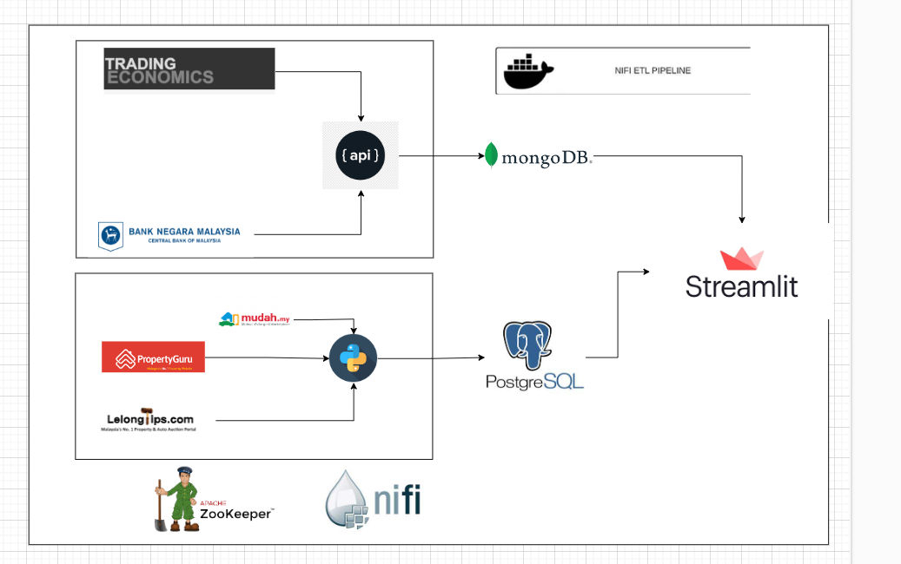

# Objective 
 Run end to end pipeline to scrape lelong & real estate deals according to states and postcode
 1. Property Sites 
 - Mudah.my
 - Propertyguru

& to pull data from open API such 
- tradingeconomics
- bank negara malaysia portal 

Overall Plans 


## Why Zookeeper

1. Configuration management in distributed system 
2. Reduce complexity in overall system and avoid custom code 
- Database
- Load Balancer
- Naming Nodes 
- Config Management (provide latests config information to a new node so it come quickly)
- Locking and synchronization 
- CLuster management (add, sizing, removing new node in cluster)
- Data registry (high available registry for data in cluster)
- Leader Election( which node is down or up, and their properties)


## Adding python into nifi container so that we can run execute command processor since when we extend the image of nifi to add python , we got error module not found (this is bypass solution)

```
docker exec -it --user root <containerid> /bin/bash 
```

```
passwd root 
```

install nifi in the container 

sudo apt update
sudo apt upgrade
sudo apt install python3
python3 --version
sudo apt install python3-pip
pip3 --version
python3 -m venv nifi-env
python3 -m pip install --upgrade pip

### Install webdriver and point it from py script 

https://chromedriver.storage.googleapis.com/114.0.5735.90/chromedriver_linux64.zip

### Notes : next time to run extended version where pip install selenium 

Open a terminal.

Update the package lists and upgrade existing packages by running the following commands:

shell
Copy code
sudo apt update
sudo apt upgrade
Install the dependencies necessary for installing Chrome by running the following command:

shell
Copy code
sudo apt install -y wget curl gnupg
Download the Google Chrome signing key by running the following command:

shell
Copy code
wget -q -O - https://dl.google.com/linux/linux_signing_key.pub | sudo gpg --dearmor -o /usr/share/keyrings/google-chrome-linux-keyring.gpg
Set up the Google Chrome repository by running the following command:

shell
Copy code
echo "deb [arch=amd64 signed-by=/usr/share/keyrings/google-chrome-linux-keyring.gpg] http://dl.google.com/linux/chrome/deb/ stable main" | sudo tee /etc/apt/sources.list.d/google-chrome.list
Update the package lists again to include the Google Chrome repository:

shell
Copy code
sudo apt update
Install Google Chrome by running the following command:

shell
Copy code
sudo apt install -y google-chrome-stable
This command installs the stable version of Google Chrome.

After the installation is complete, you can launch Google Chrome by searching for it in your applications menu or by running the following command:

shell
Copy code
google-chrome-stable